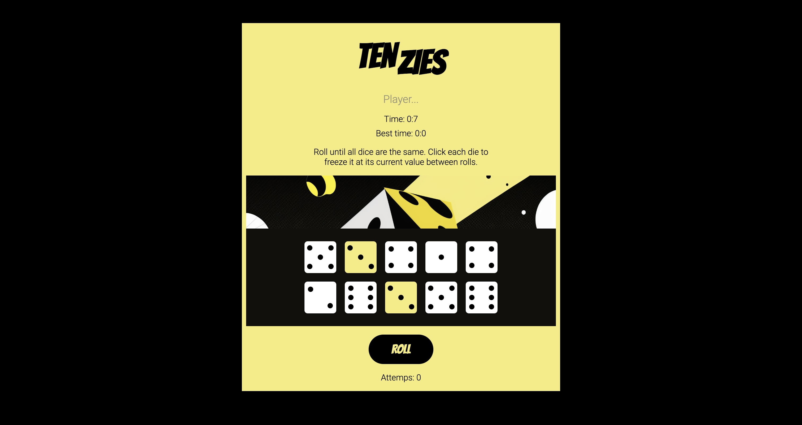

# Tenzies Game

Welcome to the Tenzies game! This project was created as a part of the React course on [Scrimba](https://scrimba.com/learn/learnreact). It's designed to help you learn and practice React concepts while building a functional and interactive dice racing game.

## Table of Contents

- [UI Screenshot](#ui-screenshot)
- [Introduction](#introduction)
- [Technologies](#technologies)
- [Installation](#installation)
- [Find a Bug?](#find-a-bug)
- [Known Issues](#known-issues-work-in-progress)
- [Other Information](#other-information)

## UI Screenshot 



## Introduction

Tenzies is a unique dice racing game where you can freeze the dice by clicking the ones that have the same values and roll the remaining until all the dice show the same face. This project serves as an excellent playground to practice core React features, including useState and useEffect hooks, conditional rendering, and local storage. Additionally, it showcases CSS Grid usage for styling the pips of the dice.

The project's uniqueness extends to its user interface, which features custom CSS styling, Game Stats tracking, and interaction with LocalStorage for storing player name and score.

## Technologies
This project was scaffoldede with [Vite plugin](https://vitejs.dev) for React.
Deployed on [Netlify](https://www.netlify.com).

## Installation

To get the game up and running on your local machine, follow these steps:

1. Clone this repository to your local machine or download the source code as a ZIP file.
2. Navigate to the project directory using the command line.

```bash
cd tenzies-game
```
3. Start the project with the Terminal

```bash
npm run dev
```
A new window will pop up at `localhost:3000`.

## Find a bug? 

If you encounter any issues or would like to submit an improvement to this project, please don't hesitate to create an issue using the "Issues" tab above!

## Known issues (Work in Progress)

The "Best Time" feature is currently under development and not functioning as intended. Stay tuned for updates!

## Other Information
The game is also available online! You can [play it here](https://celadon-scone-b48176.netlify.app). Have fun!
